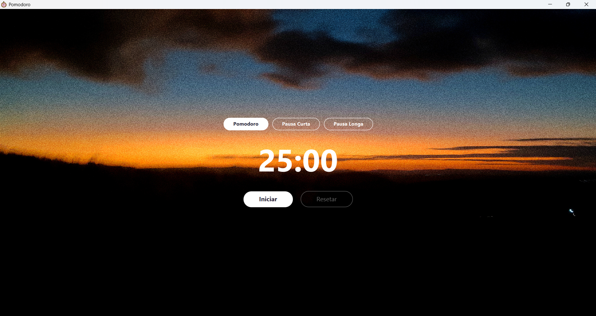

<p align="center">
  
</p>
# PomodoroFX


Aplicativo de timer Pomodoro desenvolvido com JavaFX como projeto de estudo.

---

## 📸 Screenshots

<p align="center">
  
</p>


---

## 🚀 Como rodar o projeto

### Pré-requisitos

- Java 21 ou superior
- Maven
- IntelliJ IDEA (recomendado)

### Passos

1. Clone o repositório:

```bash
git clone https://github.com/CarolinaaCabral/PomodoroFX.git
```

2. Abra o projeto no IntelliJ IDEA
3. Aguarde o Maven baixar as dependências
4. Execute a classe `Launcher.java`

---

## 🛠️ Tecnologias utilizadas

- **Java 21**
- **JavaFX** — interface gráfica desktop
- **Maven** — gerenciamento de dependências
- **CSS** — estilização da interface

---

## ⚙️ Funcionalidades

- ⏱️ Timer de 25 minutos
- ▶️ Botão de iniciar / pausar
- 🔄 Botão de resetar
- 🎨 Interface estilizada com imagem de fundo

---

## 🎨 Créditos

- Imagem de fundo: autoral © Carolina Cabral — todos os direitos reservados
- Ícone da aplicação: autoral © Carolina Cabral — todos os direitos reservados
- Som de notificação: [Pixabay](https://pixabay.com/sound-effects/technology-new-notification-036-485897/)

---

## 📚 Sobre

Projeto desenvolvido para praticar **Java**, **JavaFX** e boas práticas de desenvolvimento como versionamento com **Git**.
